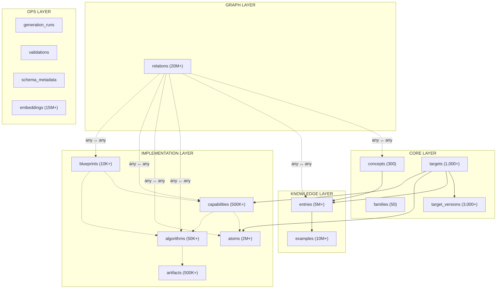

# MAGB — Future-Proof Schema Architecture

> **The Universal Blueprint Machine — Database Schema Specification**
> Synthesized from both Opus 4.6 architecture docs (Thinking + Non-Thinking) with additions for production readiness.

---

## Architecture At a Glance



---

## 10 Key Design Decisions

| # | Decision | Rationale |
|---|----------|-----------|
| 1 | **Universal concept layer** | 1,000 targets share ~200 concepts. Store once, link everywhere. Enables cross-target comparison. |
| 2 | **Family inheritance** | ZIP-based formats share 60% structure. C-family languages share syntax. Generate shared knowledge once. |
| 3 | **Delta version chains** | Python 3.12→3.13 differs by ~2%. Storing full copies wastes 98%. Deltas make "what changed?" queries free. |
| 4 | **Multi-resolution content** (micro/standard/exhaustive) | AI context windows are finite. 50 tokens for listings, 500 for Q&A, 2000 for deep implementation. AI can budget context dynamically. |
| 5 | **Embeddings as first-class** (per resolution) | Primary access pattern is semantic search. Separate embeddings per resolution capture different semantic neighborhoods. |
| 6 | **Relations as explicit typed graph edges** | "Python's for is like Rust's for...in" can't be discovered from flat storage. Graph enables dependency resolution, translation guides, learning paths. |
| 7 | **Self-describing schema** | An AI querying this DB should understand the schema without external docs. `schema_metadata` table explains every table/column. |
| 8 | **Pre-computed token counts** | AI must plan context window usage. Can't afford counting tokens at query time across 5M entries. |
| 9 | **PostgreSQL + pgvector** | One database for structured data, vector search, recursive CTEs (graph traversal), and full-text search. 250GB fits single instance. |
| 10 | **Provenance on everything** | Every entry knows which model generated it, when, and confidence level. Enables targeted regeneration when better models arrive. |

---

## Data Layering Model

```
┌─────────────────────────────────────────────────────────────────────────┐
│                        UNIVERSAL CONCEPT LAYER                          │
│   ~200-300 concepts: iteration, compression, color spaces...           │
│   Language-agnostic / format-agnostic ideas                            │
├─────────────────────────────────────────────────────────────────────────┤
│                          FAMILY LAYER                                   │
│   ~50 families: C-family, ML-family, OPC formats, image formats...     │
│   Shared traits inherited by all members                               │
├─────────────────────────────────────────────────────────────────────────┤
│                          TARGET LAYER                                   │
│   ~1,000 targets with version chains: Python 3.10→3.11→3.12→3.13      │
│   Specific languages, formats, tools                                   │
├─────────────────────────────────────────────────────────────────────────┤
│                       IMPLEMENTATION LAYER                              │
│   ~5,000,000 entries: atoms, capabilities, algorithms, blueprints      │
│   Target-specific construction knowledge                               │
└─────────────────────────────────────────────────────────────────────────┘
```

> [!IMPORTANT]
> Knowledge flows **downward** through inheritance and gets **more specific** at each layer. A query about Python's `for` loop returns:
> 1. Universal concept of iteration (theory)
> 2. Family-level traits (C-family patterns Python partly shares)
> 3. Target-specific syntax/semantics/edge cases
> 4. Version-specific additions (3.10+ structural pattern matching)

---

## Complete Table Specifications

### Core Layer

#### `concepts`
Universal ideas spanning multiple targets. The skeleton the entire KB hangs on.

| Column | Type | Description |
|--------|------|-------------|
| `id` | `TEXT PK` | Hierarchical ID: `"iteration.definite"` |
| `name` | `TEXT NOT NULL` | Human-readable: `"Definite Iteration (For Loop)"` |
| `domain` | `TEXT NOT NULL` | Domain enum: `control_flow`, `compression`, `graphics_2d`, etc. |
| `parent_id` | `TEXT FK → concepts` | Concept taxonomy parent |
| `summary` | `TEXT` | ~50 tokens — micro resolution |
| `description` | `TEXT` | ~300 tokens — standard resolution |
| `theory` | `TEXT` | ~1000 tokens — CS theory deep dive |
| `prevalence` | `REAL DEFAULT 1.0` | Fraction of targets implementing this (0.0–1.0) |
| `notable_absences` | `TEXT[]` | Targets that *don't* have this |
| `metadata` | `JSONB DEFAULT '{}'` | Extensible structured data |
| `created_at` | `TIMESTAMPTZ` | |
| `updated_at` | `TIMESTAMPTZ` | |

> [!TIP]
> ~300 rows at full scale. This is the **conceptual backbone** — query concepts first for language-agnostic understanding, then join to entries for target-specific details.

---

#### `families`
Language/format families that share knowledge.

| Column | Type | Description |
|--------|------|-------------|
| `id` | `TEXT PK` | `"c_family"`, `"opc_formats"` |
| `name` | `TEXT NOT NULL` | `"C-Family Languages"` |
| `type` | `TEXT NOT NULL` | `language_family` or `format_family` |
| `description` | `TEXT` | |
| `shared_traits` | `JSONB DEFAULT '[]'` | Array of `{trait, description}` inherited by members |
| `shared_entry_ids` | `TEXT[]` | Entry IDs inherited by all family members |
| `metadata` | `JSONB DEFAULT '{}'` | |

---

#### `targets`
The actual languages, formats, tools we document.

| Column | Type | Description |
|--------|------|-------------|
| `id` | `TEXT PK` | `"python"`, `"pptx"`, `"photoshop"` |
| `name` | `TEXT NOT NULL` | `"Python"` |
| `type` | `TEXT NOT NULL` | See `TargetKind` enum below |
| `family_ids` | `TEXT[]` | Families this target belongs to |
| `traits` | `JSONB NOT NULL DEFAULT '{}'`| Classification traits (typing, memory, paradigms, etc.) |
| `distinguishing` | `TEXT[]` | What makes this target unique vs its families |
| `similar_to` | `TEXT[]` | Similar targets for cross-reference/gap analysis |
| `extensions` | `TEXT[]` | File extensions: `[".py"]`, `[".pptx"]` |
| `media_types` | `TEXT[]` | MIME types |
| `spec_url` | `TEXT` | Official specification URL |
| `status` | `TEXT DEFAULT 'active'` | `active`, `deprecated`, `draft`, `historical` |
| `generation_status` | `TEXT DEFAULT 'pending'` | `pending`, `generating`, `complete`, `failed` |
| `last_generated` | `TIMESTAMPTZ` | |
| `metadata` | `JSONB DEFAULT '{}'` | |

**TargetKind Enum Values:**
```
programming_language, markup_language, query_language, stylesheet_language,
data_serialization, document_format, presentation_format, spreadsheet_format,
image_format, audio_format, video_format, archive_format, database_format,
executable_format, network_protocol, font_format, 3d_format, cad_format,
scientific_format, configuration_format, software_tool
```

---

#### `target_versions`
Delta-chained version tracking.

| Column | Type | Description |
|--------|------|-------------|
| `id` | `TEXT PK` | `"python_3.12"` |
| `target_id` | `TEXT FK → targets` | |
| `version_string` | `TEXT NOT NULL` | `"3.12"` |
| `released` | `DATE` | |
| `status` | `TEXT` | `active`, `maintenance`, `security_fixes`, `eol` |
| `delta_from` | `TEXT FK → target_versions` | Previous version in chain |
| `additions` | `JSONB DEFAULT '[]'` | New features array |
| `changes` | `JSONB DEFAULT '[]'` | Modified features array |
| `removals` | `JSONB DEFAULT '[]'` | Removed features array |
| `deprecations` | `JSONB DEFAULT '[]'` | Newly deprecated features |
| `spec_url` | `TEXT` | |
| `changelog_url` | `TEXT` | |
| `sort_order` | `INTEGER` | Ordering within target |

> [!NOTE]
> **Delta chains** are the key versioning strategy. Python 3.13 stores only what changed from 3.12. Full-version queries walk the chain: 3.10 → apply Δ3.11 → apply Δ3.12 → apply Δ3.13. This gives:
> - ~98% storage deduplication
> - Instant "what changed?" queries
> - Cheap new-version generation

---

### Knowledge Layer

#### `entries`
The **core content table**. Every piece of knowledge lives here at three resolutions.

| Column | Type | Description |
|--------|------|-------------|
| `id` | `TEXT PK` | `"python_for_loop"` |
| `concept_id` | `TEXT FK → concepts` | Universal concept link |
| `target_id` | `TEXT NOT NULL FK → targets` | |
| `path` | `TEXT NOT NULL` | Hierarchical path: `"Python/Control Flow/Iteration/for loop"` |
| `entry_type` | `TEXT NOT NULL` | `reference`, `atom`, `capability`, `algorithm` |
| `introduced_in` | `TEXT FK → target_versions` | When this appeared |
| `removed_in` | `TEXT FK → target_versions` | When removed (null = still present) |
| `changed_in` | `TEXT[]` | Version IDs where this changed |
| **Multi-Resolution Content** | | |
| `content_micro` | `TEXT` | ~50 tokens — for summaries and listings |
| `content_standard` | `TEXT` | ~500 tokens — for most queries |
| `content_exhaustive` | `TEXT` | ~2000 tokens — for deep dives |
| **Structured Fields** | | |
| `syntax` | `TEXT` | Formal syntax/grammar |
| `parameters` | `JSONB DEFAULT '[]'` | Parameter descriptions |
| `return_value` | `TEXT` | Return type and description |
| `edge_cases` | `JSONB DEFAULT '[]'` | |
| `common_mistakes` | `JSONB DEFAULT '[]'` | |
| **Token Counts** (pre-computed) | | |
| `tokens_micro` | `INTEGER` | |
| `tokens_standard` | `INTEGER` | |
| `tokens_exhaustive` | `INTEGER` | |
| **Provenance** | | |
| `generated_by` | `TEXT` | Model name |
| `generated_at` | `TIMESTAMPTZ` | |
| `validated_by` | `TEXT` | Validator model name |
| `confidence` | `REAL DEFAULT 0.0` | 0.0–1.0 |
| `content_hash` | `TEXT` | SHA-256 for change detection |
| `validation_notes` | `TEXT` | |
| `metadata` | `JSONB DEFAULT '{}'` | |
| **Constraint** | `UNIQUE(target_id, path)` | |

> [!IMPORTANT]
> **Multi-resolution content** is the most critical design decision. Without it:
> - Summary queries waste 12,000 tokens loading full entries for 6 concepts
> - With micro: same query uses 300 tokens
> 
> The AI dynamically selects the right resolution per-entry to maximize information within its context window.

---

#### `examples`
Code examples, reusable across entries.

| Column | Type | Description |
|--------|------|-------------|
| `id` | `TEXT PK` | |
| `entry_id` | `TEXT FK → entries` | Primary owning entry |
| `title` | `TEXT NOT NULL` | |
| `code` | `TEXT NOT NULL` | The actual code |
| `language` | `TEXT NOT NULL` | Syntax highlighting language |
| `explanation` | `TEXT` | What the example demonstrates |
| `expected_output` | `TEXT` | What running it produces |
| `complexity` | `TEXT DEFAULT 'basic'` | `basic`, `intermediate`, `advanced`, `edge_case` |
| `valid_from` | `TEXT FK → target_versions` | Only valid from this version |
| `valid_until` | `TEXT FK → target_versions` | Invalid after this version |
| `also_used_by` | `TEXT[]` | Other entry IDs referencing this example |
| `token_count` | `INTEGER` | |
| `metadata` | `JSONB DEFAULT '{}'` | |

---

### Implementation Layer

#### `atoms`
Irreducible structural elements of file formats — the "periodic table" of file formats.

| Column | Type | Description |
|--------|------|-------------|
| `id` | `TEXT PK` | |
| `target_id` | `TEXT NOT NULL FK → targets` | |
| `entry_id` | `TEXT FK → entries` | Links to Layer 1 entry |
| `atom_type` | `TEXT NOT NULL` | `xml_element`, `binary_field`, `json_key`, `enum_value`, etc. |
| `file_path` | `TEXT` | Where in the format |
| `xpath` | `TEXT` | For XML formats |
| `byte_offset` | `TEXT` | For binary formats |
| `element_name` | `TEXT` | |
| `namespace_uri` | `TEXT` | |
| `namespace_prefix` | `TEXT` | |
| `structure` | `JSONB NOT NULL DEFAULT '{}'` | data_type, byte_size, endianness, encoding, attributes, valid_values, constraints |
| `parent_atom_id` | `TEXT FK → atoms` | Hierarchy within format |
| `semantic_meaning` | `TEXT` | |
| `unit_of_measure` | `TEXT` | |
| `conversion_formula` | `TEXT` | |
| `example_value` | `TEXT` | |
| `example_context` | `TEXT` | In-situ example |
| `metadata` | `JSONB DEFAULT '{}'` | |

---

#### `algorithms`
Complete computational procedures. **Shared across targets** (a Gaussian blur documented for Photoshop is the same algorithm needed for GIMP, CSS filters, SVG filters, WebGL).

| Column | Type | Description |
|--------|------|-------------|
| `id` | `TEXT PK` | `"algo_gaussian_blur"` |
| `name` | `TEXT NOT NULL` | |
| `category` | `TEXT NOT NULL` | `image_filter`, `compression`, `encoding`, etc. |
| `domain` | `TEXT NOT NULL` | `ConceptDomain` enum value |
| `purpose` | `TEXT` | What it computes/transforms |
| **Math** | | |
| `formula` | `TEXT` | LaTeX or plain text |
| `formula_explanation` | `TEXT` | |
| `pseudocode` | `TEXT` | |
| **Multi-resolution** | | |
| `summary` | `TEXT` | One-sentence description |
| `full_spec` | `TEXT` | Complete specification |
| **Parameters** | | |
| `parameters` | `JSONB DEFAULT '[]'` | `{name, type, range, default, effect, performance_impact}` |
| **Complexity** | | |
| `time_complexity` | `TEXT` | Big-O |
| `space_complexity` | `TEXT` | Big-O |
| **Optimizations** | | |
| `optimizations` | `JSONB DEFAULT '[]'` | `{name, technique, speedup, tradeoff, when_to_use}` |
| **Edge Cases & Test Vectors** | | |
| `edge_cases` | `JSONB DEFAULT '[]'` | |
| `test_vectors` | `JSONB DEFAULT '[]'` | Known input→output pairs |
| `numerical_stability` | `JSONB DEFAULT '{}'` | Precision issues and mitigations |
| **Provenance** | | |
| `confidence` | `TEXT DEFAULT 'generated'` | `verified`, `high`, `medium`, `low`, `generated` |
| `references` | `TEXT[]` | Academic papers, spec sections |
| `metadata` | `JSONB DEFAULT '{}'` | |

> [!TIP]
> Algorithms are the primary deduplication win. At 1,000 targets, ~60% of algorithmic knowledge is **reused**. DEFLATE appears once, linked to PNG, TIFF, ZIP, HTTP, PDF. This saves ~40-60% of generation costs.

---

#### `capabilities`
User-facing features with implementation specs.

| Column | Type | Description |
|--------|------|-------------|
| `id` | `TEXT PK` | |
| `target_id` | `TEXT NOT NULL FK → targets` | |
| `name` | `TEXT NOT NULL` | `"Draw Rectangle Shape"` |
| `category` | `TEXT NOT NULL` | |
| `user_description` | `TEXT` | What the user sees |
| `technical_description` | `TEXT` | How it works under the hood |
| `complexity` | `TEXT DEFAULT 'moderate'` | `trivial`, `basic`, `intermediate`, `advanced`, `expert` |
| `implementation_steps` | `JSONB DEFAULT '[]'` | `[{order, description, atom_ids, algorithm_ids, code_template, validation}]` |
| `reference_implementations` | `JSONB DEFAULT '{}'` | `{python: "...", rust: "...", javascript: "..."}` |
| `minimum_working_example` | `TEXT` | |
| `known_pitfalls` | `JSONB DEFAULT '[]'` | |
| `metadata` | `JSONB DEFAULT '{}'` | |

---

#### `blueprints`
Composable architecture plans — how to build complete applications from capabilities.

| Column | Type | Description |
|--------|------|-------------|
| `id` | `TEXT PK` | |
| `target_id` | `TEXT FK → targets` | Can be NULL for cross-target blueprints |
| `name` | `TEXT NOT NULL` | `"Complete PPTX Shape Engine"` |
| `scope` | `TEXT NOT NULL` | `single_feature`, `feature_group`, `full_module`, `full_application` |
| `description` | `TEXT` | |
| `capability_ids` | `TEXT[]` | |
| `algorithm_ids` | `TEXT[]` | |
| `module_structure` | `JSONB DEFAULT '[]'` | |
| `class_hierarchy` | `JSONB DEFAULT '[]'` | |
| `public_api` | `JSONB DEFAULT '[]'` | `[{signature, description, example}]` |
| `build_sequence` | `JSONB DEFAULT '[]'` | `[{phase, name, components, milestone, test_criteria, estimated_effort_hours}]` |
| `minimal_implementation` | `JSONB DEFAULT '{}'` | `{code, capabilities_covered, lines_of_code}` |
| `extension_points` | `JSONB DEFAULT '[]'` | `[{name, purpose, pattern}]` |
| `integration_tests` | `JSONB DEFAULT '[]'` | |
| `metadata` | `JSONB DEFAULT '{}'` | |

---

#### `artifacts`
Large, reusable, executable knowledge blobs.

| Column | Type | Description |
|--------|------|-------------|
| `id` | `TEXT PK` | |
| `type` | `TEXT NOT NULL` | `code_example`, `algorithm_impl`, `file_template`, `binary_spec`, `schema`, `test_vector`, `migration_guide` |
| `name` | `TEXT` | |
| `description` | `TEXT` | |
| `content` | `TEXT` | Inline content if < 10KB |
| `content_ref` | `TEXT` | S3/blob reference if large |
| `content_hash` | `TEXT` | SHA-256 for integrity |
| `content_size` | `INTEGER` | Bytes |
| `token_count` | `INTEGER` | |
| `implementations` | `JSONB DEFAULT '{}'` | `{python: {code, tested, test_ids}, rust: {...}}` |
| `test_vector_ids` | `TEXT[]` | |
| `is_tested` | `BOOLEAN DEFAULT FALSE` | |
| `referenced_by` | `TEXT[]` | Entry IDs referencing this |
| `metadata` | `JSONB DEFAULT '{}'` | |

---

### Graph Layer

#### `relations`
The knowledge graph itself. **Typed, directional, weighted edges between any entities.**

| Column | Type | Description |
|--------|------|-------------|
| `id` | `BIGSERIAL PK` | |
| `source_id` | `TEXT NOT NULL` | Canonical ID of source entity |
| `source_type` | `TEXT NOT NULL` | `concept`, `entry`, `atom`, `capability`, `algorithm`, `blueprint`, `target`, `artifact` |
| `target_id` | `TEXT NOT NULL` | Canonical ID of target entity |
| `target_type` | `TEXT NOT NULL` | Same enum as source_type |
| `relation_type` | `TEXT NOT NULL` | See relation types below |
| `strength` | `REAL DEFAULT 1.0` | 0.0–1.0 |
| `bidirectional` | `BOOLEAN DEFAULT FALSE` | |
| `context` | `TEXT` | Human/AI-readable explanation |
| `discovered_by` | `TEXT` | Which phase/model found this |
| `confidence` | `REAL DEFAULT 1.0` | |
| `metadata` | `JSONB DEFAULT '{}'` | |

**Relation Types:**

```
HIERARCHICAL:      PARENT_OF, CHILD_OF
CONCEPTUAL:        IMPLEMENTS, VARIANT_OF, EQUIVALENT_TO, OPPOSITE_OF, SUPERSET_OF
PRACTICAL:         REQUIRES, COMMONLY_USED_WITH, REPLACES, ALTERNATIVE_TO, ANTI_PATTERN_OF
IMPLEMENTATION:    DEPENDS_ON, COMPOSES_INTO, SHARES_ATOM_WITH, TEMPLATE_FOR, USES_ALGORITHM
CROSS-TARGET:      ANALOGOUS_IN, TRANSLATES_TO, INSPIRED_BY
FORMAT-SPECIFIC:   CONTAINED_IN, REFERENCES_VIA, INHERITS_STYLE
BLUEPRINT:         BUILDS_WITH, PRODUCES
OPTIMIZATION:      OPTIMIZES, SPECIALIZES, GENERALIZES
```

---

### Operations Layer

#### `generation_runs`
Track AI generation campaigns.

| Column | Type | Description |
|--------|------|-------------|
| `id` | `TEXT PK` | |
| `target_id` | `TEXT FK → targets` | |
| `started_at` | `TIMESTAMPTZ` | |
| `completed_at` | `TIMESTAMPTZ` | |
| `status` | `TEXT DEFAULT 'running'` | `running`, `completed`, `failed`, `paused` |
| `config` | `JSONB` | Model config, prompts used, etc. |
| `current_phase` | `INTEGER` | 1-12 pipeline phase |
| `total_api_calls` | `INTEGER DEFAULT 0` | |
| `total_tokens` | `INTEGER DEFAULT 0` | |
| `total_cost_usd` | `REAL DEFAULT 0.0` | |
| `nodes_created` | `INTEGER DEFAULT 0` | |
| `edges_created` | `INTEGER DEFAULT 0` | |
| `errors` | `JSONB DEFAULT '[]'` | |
| `completeness` | `JSONB DEFAULT '{}'` | Coverage metrics |

---

#### `validations`
Track verification results.

| Column | Type | Description |
|--------|------|-------------|
| `id` | `SERIAL PK` | |
| `entity_id` | `TEXT NOT NULL` | Canonical ID of validated entity |
| `entity_type` | `TEXT NOT NULL` | |
| `validation_type` | `TEXT` | `code_execution`, `cross_reference`, `human_review`, `spec_check`, `model_review` |
| `passed` | `BOOLEAN` | |
| `confidence` | `REAL` | 0.0–1.0 |
| `details` | `JSONB` | Structured validation results |
| `validator_model` | `TEXT` | Which AI model validated |
| `validated_at` | `TIMESTAMPTZ` | |

---

#### `embeddings`
Decoupled vector storage for clean separation and flexible backend swapping.

| Column | Type | Description |
|--------|------|-------------|
| `id` | `SERIAL PK` | |
| `entity_id` | `TEXT NOT NULL` | Canonical ID |
| `entity_type` | `TEXT NOT NULL` | |
| `resolution` | `TEXT NOT NULL` | `micro`, `standard`, `exhaustive`, `full` |
| `vector` | `vector(1536)` | pgvector embedding |
| `model` | `TEXT` | Which embedding model produced this |
| `created_at` | `TIMESTAMPTZ` | |
| **Constraint** | `UNIQUE(entity_id, resolution)` | |

> [!NOTE]
> Separate embeddings table allows:
> - Swapping vector backends without touching content tables
> - Regenerating embeddings with newer models without data loss
> - Different embedding dimensions for different models
> - Clean separation of concerns

---

#### `schema_metadata`
Self-describing schema for AI introspection.

| Column | Type | Description |
|--------|------|-------------|
| `table_name` | `TEXT NOT NULL` | |
| `column_name` | `TEXT` | NULL = table-level description |
| `description` | `TEXT NOT NULL` | Human AND AI readable |
| `ai_usage_hint` | `TEXT` | How an AI should use this field |
| `example_query` | `TEXT` | Example SQL for common patterns |
| **Constraint** | `PK(table_name, column_name)` | |

---

## Index Strategy

### Vector Indices (HNSW for approximate nearest neighbor)
```sql
CREATE INDEX idx_emb_vector ON embeddings USING hnsw (vector vector_cosine_ops);
```

> [!TIP]
> Single HNSW index on the `embeddings` table, filtered by `entity_type` and `resolution` at query time. This is simpler than per-column embeddings and allows for heterogeneous embedding dimensions in the future.

### Graph Traversal Indices
```sql
CREATE INDEX idx_rel_source       ON relations(source_id, source_type);
CREATE INDEX idx_rel_target       ON relations(target_id, target_type);
CREATE INDEX idx_rel_type         ON relations(relation_type);
CREATE INDEX idx_rel_source_type  ON relations(source_id, relation_type);
CREATE INDEX idx_rel_target_type  ON relations(target_id, relation_type);
```

### Hierarchy & Lookup Indices
```sql
CREATE INDEX idx_entries_target_path   ON entries(target_id, path);
CREATE INDEX idx_entries_concept       ON entries(concept_id);
CREATE INDEX idx_entries_target_type   ON entries(target_id, entry_type);
CREATE INDEX idx_atoms_parent          ON atoms(parent_atom_id);
CREATE INDEX idx_atoms_target          ON atoms(target_id);
CREATE INDEX idx_versions_target       ON target_versions(target_id);
CREATE INDEX idx_versions_delta        ON target_versions(delta_from);
CREATE INDEX idx_validations_entity    ON validations(entity_id);
CREATE INDEX idx_emb_entity            ON embeddings(entity_id, resolution);
```

### Full-Text Search
```sql
CREATE INDEX idx_entries_fts ON entries 
    USING gin(to_tsvector('english', 
        coalesce(content_micro,'') || ' ' || 
        coalesce(content_standard,'') || ' ' || 
        coalesce(path,'')));
```

### JSONB Indices
```sql
CREATE INDEX idx_entries_metadata  ON entries  USING gin(metadata);
CREATE INDEX idx_targets_traits    ON targets  USING gin(traits);
```

---

## Volume Projections at 1,000 Targets

| Table | Row Count | Avg Row Size | Total Size |
|-------|-----------|-------------|------------|
| concepts | 300 | 2 KB | 0.6 MB |
| families | 50 | 1 KB | 0.05 MB |
| targets | 1,000 | 2 KB | 2 MB |
| target_versions | 3,000 | 1 KB | 3 MB |
| **entries** | **5,000,000** | **4 KB** | **20 GB** |
| **examples** | **10,000,000** | **1 KB** | **10 GB** |
| atoms | 2,000,000 | 2 KB | 4 GB |
| capabilities | 500,000 | 3 KB | 1.5 GB |
| algorithms | 50,000 | 5 KB | 0.25 GB |
| blueprints | 10,000 | 10 KB | 0.1 GB |
| **relations** | **20,000,000** | **0.2 KB** | **4 GB** |
| artifacts | 500,000 | 3 KB | 1.5 GB |
| **embeddings** | **15,000,000** | **6 KB** | **90 GB** |
| HNSW indices | — | — | ~45 GB |
| B-tree indices | — | — | ~15 GB |
| FTS indices | — | — | ~8 GB |
| **GRAND TOTAL** | **38M+** | — | **~250 GB** |

> Fits on a single PostgreSQL instance. Comfortably within a ~$100/month managed database.

---

## Deduplication Strategy

```
WITHOUT DEDUP:   1,000 targets × $80 avg = $80,000
WITH DEDUP:      
  Wave 1:  10 targets × $80  =   $800  (foundation — establish core algos)
  Wave 2:  40 targets × $50  = $2,000  (37% reuse)
  Wave 3: 100 targets × $35  = $3,500  (56% reuse)
  Wave 4: 150 targets × $25  = $3,750  (69% reuse)
  Wave 5: 700 targets × $20  = $14,000 (75% reuse)
                                ─────────────────
  TOTAL:                       ~$24,050 (70% savings)
```

The deduplication engine checks before generating:
1. **Exact ID match** — algorithm already exists
2. **Fuzzy name search** — semantically equivalent knowledge exists
3. **Specialization check** — existing knowledge can be specialized (generate only delta)

Result: `skip` | `link` | `generate` | `specialize`

---

## AI Query Patterns

### Pattern 1: Context Window Budget Planning
```
AI has 4096-token budget. 20 relevant entries found.

                         Tokens
  Option A: 20 × micro     = 1,000  ← room for more detail
  Option B: 5 × standard   
           + 15 × micro    = 3,250  ← good balance  ✓
  Option C: 1 × exhaustive 
           + 2 × standard  
           + 17 × micro    = 3,850  ← maximum detail within budget
```

### Pattern 2: Capability Bundle Assembly
```
Query: "I want to draw a rectangle in PPTX"

RETURNS:
├── Capability:  "Draw Rectangle Shape" with implementation steps
├── Atoms:       7 XML elements across 3 namespaces  
├── Algorithm:   EMU coordinate conversion (1 inch = 914400)
├── Prerequisites: "Create Slide" → "Create Presentation Container"
├── Composition: "Shadow renders before reflection, chart after shapes"
├── Code:        Complete working Python function
└── Validation:  "Opens in PowerPoint without errors"
```

### Pattern 3: Cross-Target Comparison
```
Query: "How does error handling differ between Python and Rust?"

JOIN entries e1, entries e2 ON same concept_id
WHERE e1.target = 'python' AND e2.target = 'rust'
  AND concept = 'error_handling'

PLUS: ANALOGOUS_IN relation context:
  "Python uses try/except (exception-based, implicit).
   Rust uses Result<T,E> (type-based, explicit)."
```

---

## Phased Implementation Plan

### Phase 1: Foundation (Week 1-2)
- [ ] Set up PostgreSQL with pgvector extension
- [ ] Implement `concepts`, `targets`, `target_versions`, `families` tables
- [ ] Build KnowledgeNode creation and content-addressed hashing
- [ ] Implement basic `relations` edge table
- [ ] Seed `schema_metadata`

### Phase 2: Knowledge Layer (Week 3-4)
- [ ] Implement `entries` with multi-resolution content
- [ ] Implement `examples` with version-aware validity
- [ ] Build full-text search indices
- [ ] Add `embeddings` table with pgvector HNSW
- [ ] Implement context-window budget planning queries

### Phase 3: Implementation Layer (Week 5-6)
- [ ] Implement `atoms`, `algorithms`, `capabilities`, `blueprints`, `artifacts`
- [ ] Build deduplication engine with semantic equivalence checking
- [ ] Implement graph traversal (recursive CTEs for dependency resolution)
- [ ] Build capability bundle assembly queries

### Phase 4: Operations Layer (Week 7-8)
- [ ] Implement `generation_runs` tracking
- [ ] Implement `validations` with multi-axis confidence scoring
- [ ] Build AI-native query interface
- [ ] Implement the 12-phase generation pipeline

### Phase 5: Scale & Polish (Week 9-10)
- [ ] Generation wave ordering optimization (families → targets)
- [ ] Cross-target relation discovery
- [ ] Performance tuning (index optimization, query planning)
- [ ] Export pipeline (JSON, Markdown, COMPLETE_DATABASE.json)

---

## Critical Differences from Design Docs

> [!WARNING]
> The two Opus 4.6 database architecture docs **conflict** in several areas. Here's how this schema resolves them:

| Tension | Non-Thinking Doc | Thinking Doc | **This Schema** |
|---------|------------------|--------------|-----------------|
| **Entity modeling** | Single `KnowledgeNode` table (type discriminator) | Separate tables per entity | **Separate tables** — better indexing, clearer constraints, easier to reason about |
| **Storage backend** | SQLite (simple, portable) | PostgreSQL + pgvector | **PostgreSQL + pgvector** — production-grade, vector search, recursive CTEs |
| **Content resolution** | Single `content` JSON blob | Multi-resolution (micro/standard/exhaustive) | **Multi-resolution** — critical for AI context budgeting |
| **Versioning** | Version field on nodes | Delta chains with inheritance | **Delta chains** — 98% dedup, instant "what changed?" |
| **Embeddings** | In-table BLOB column | Per-resolution in entries table | **Separate `embeddings` table** — cleanest separation, easiest to swap backends |
| **Classification** | 6 entity types + content schemas | 5 core structures + implementation layer | **12 tables** synthesizing both approaches for maximum clarity |
| **Deduplication** | Runtime dedup engine | Family-based inheritance | **Both** — family inheritance for structural dedup + runtime engine for semantic dedup |
