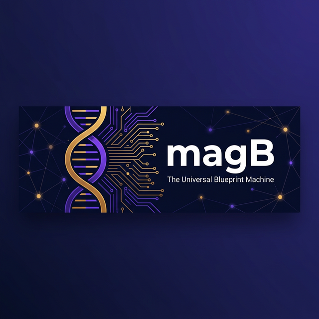

<p align="center">
  
</p>

<h1 align="center">magB</h1>

<h3 align="center">
  <em>The Universal Blueprint Machine</em>
</h3>

<p align="center">
  <strong>What if you could download "knowing everything" about any technology — instantly?</strong>
</p>

<p align="center">
  <a href="#-what-is-magb"></a>
  <a href="#-quick-start"></a>
  <a href="docs/guides/getting-started.md"></a>
  <a href="#-community"></a>
</p>

<p align="center">
  <a href="LICENSE"></a>
  
  
  <a href="CODE_OF_CONDUCT.md"></a>
</p>

---

## 🤔 The Problem

You want to build something that works with PowerPoint files. Or PDF. Or PNG. Or you want to deeply master a programming language.

**Here's what happens today:**

| What Exists | What You Actually Need |
|---|---|
| 📚 5,000-page specifications nobody reads | *"Give me the exact code to draw a red circle in a .pptx file"* |
| 📖 Documentation that assumes you already know things | *"What are ALL the algorithms I need for every Photoshop filter, with actual working code?"* |
| 🎓 Tutorials that teach one narrow path | *"Show me the exact binary layout of a PNG file, with code that builds one from scratch"* |
| 💬 Stack Overflow fragments that sometimes contradict each other | *"Give me a complete architecture for building a PDF editor, with every component specified"* |

**The gap:** Nowhere does a single, complete, structured, machine-readable source exist that contains *everything* needed to fully understand and implement every capability of a technology.

**Until now.**

---

## 🧬 What is magB?

**magB** is an AI-powered system that generates **complete, structured, verified knowledge bases** for any programming language, file format, or software tool.

Think of it as a **Universal Blueprint Machine** — it takes a technology name like "Python 3.12" or "PPTX" and produces a **complete operational database** containing:

```
┌─────────────────────────────────────────────────────────────┐
│                                                             │
│   LAYER 1: CAPABILITY KNOWLEDGE                            │
│   "What can this technology do?"                            │
│                                                             │
│   → Complete feature inventory (not examples — everything)  │
│   → Organized tree with dependencies mapped                 │
│                                                             │
├─────────────────────────────────────────────────────────────┤
│                                                             │
│   LAYER 2: IMPLEMENTATION KNOWLEDGE                         │
│   "How does each feature actually work?"                    │
│                                                             │
│   → Exact templates (XML, JSON, binary structures)          │
│   → Working algorithms with math and code                   │
│   → Coordinate systems, unit conversions, constraints       │
│                                                             │
├─────────────────────────────────────────────────────────────┤
│                                                             │
│   LAYER 3: INTEGRATION KNOWLEDGE                            │
│   "How do I build complete applications with this?"         │
│                                                             │
│   → Architecture blueprints for real applications           │
│   → Composition rules (what happens when features combine)  │
│   → Complete runnable starter implementations               │
│                                                             │
└─────────────────────────────────────────────────────────────┘
```

> 💡 **In plain English:** magB is like hiring the world's greatest expert on any technology, downloading their complete knowledge into a searchable database, and making that database available to everyone — developers, AI agents, and automated tools alike.

---

## ✨ Before & After

### Without magB

```
Developer: "I need to generate a PowerPoint file with a chart."

→ Google "python create pptx" 
→ Find python-pptx library 
→ Limited to its API
→ Need something it doesn't support?
→ Download 6,000-page OOXML spec
→ Read for weeks
→ Still confused about EMUs
→ Try things
→ Get corrupted files
→ Debug for hours
→ Stack Overflow
→ Repeat...

⏰ Time: Days to weeks
😤 Experience: Frustrating
```

### With magB

```
Developer: "I need to generate a PowerPoint file with a chart."

→ Query: structural_templates/__minimal_valid_file__
  → Copy generation code → valid empty .pptx in seconds ✓

→ Query: structural_templates/add_slide
  → See exact XML, exact location, exact relationships → done ✓

→ Query: algorithms/chart_data_binding
  → Complete algorithm with working code and test vectors ✓

→ Query: composition_rules/chart_and_shapes
  → "Charts must appear after shapes in spTree ordering" ✓

⏰ Time: Minutes
😊 Experience: Effortless
```

---

## 🏗️ How It Works

magB uses a **four-phase extraction pipeline** that turns AI's scattered training knowledge into verified, structured databases:

```
    INPUT                           OUTPUT
    ─────                           ──────
    "pptx"          ┌──────────┐
       │            │ DISCOVER │    "PPTX can do 127 things"
       └──────────▶ │          │──▶ Exhaustive capability tree
                    └────┬─────┘
                         │
                    ┌────▼─────┐
                    │ EXTRACT  │    Templates + algorithms + code
                    │          │──▶ for each of those 127 things
                    └────┬─────┘
                         │
                    ┌────▼─────┐
                    │ VALIDATE │    Generated code is EXECUTED
                    │          │──▶ Catches errors automatically
                    └────┬─────┘    Self-correcting loop
                         │
                    ┌────▼─────┐
                    │INTEGRATE │    Architecture blueprints
                    │          │──▶ for building real applications
                    └──────────┘

    Result: Complete generative database
            (~500 structured files, ~50-100MB)
```

**Why it works:** LLMs already contain this knowledge — scattered across their training data. magB doesn't *teach* the AI; it **extracts and verifies** what it already knows, organizing it into something immediately useful.

---

## 🚀 Quick Start

> ⚠️ **magB is currently in Alpha.** We're actively building the core pipeline. Star the repo to follow our progress!

```bash
# Clone the repository
git clone https://github.com/your-org/magb.git
cd magb

# Install dependencies
bun install

# Generate your first knowledge base (coming soon)
bun run generate --target "JSON"
```

📖 **New to magB?** Start with our [Getting Started Guide](docs/guides/getting-started.md) — no technical background required.

---

## 👥 Who Is This For?

<table>
<tr>
<td align="center" width="33%">

### 👩‍💻 Developers

Stop digging through specs and Stack Overflow. Get **exact templates, working code, and verified algorithms** for any technology.

*"I copy the template, plug in values, and it works."*

</td>
<td align="center" width="33%">

### 🤖 AI Agents

Traditional AI coding assistants guess at structures from vague training data. With magB, they get **exact templates and verified code** — dramatically improving accuracy.

*"Context-injected AI becomes precise, not probabilistic."*

</td>
<td align="center" width="33%">

### 🏢 Teams & Companies

Building a presentation engine used to require format experts and years of work. With magB, **small teams can build what only large companies could before.**

*"We built our document converter in weeks, not months."*

</td>
</tr>
</table>

---

## 🌍 Real-World Use Cases

### Build a PowerPoint Generator — From Scratch
The PPTX knowledge base gives you every XML element, every namespace, every coordinate formula. No library dependencies, no reverse engineering. Just assemble working code from verified templates.

### Build an Image Editor
The knowledge base contains **every filter algorithm** (Gaussian blur, unsharp mask, all blend modes), the **complete layer compositing pipeline**, the **brush engine dynamics system** — each with mathematical formulas, working code in multiple languages, and test vectors.

### Master a New Language
Instead of scattered tutorials, get a **complete, structured, cross-referenced guide** covering every keyword, every standard library function, every idiom and edge case. Organized for learning, optimized for reference.

### Create Format Converters
With exact structural knowledge of multiple formats, building converters becomes **template mapping** rather than reverse engineering. Know exactly how to translate a PPTX shape into an SVG element because you have both structural blueprints.

---

## 📊 By The Numbers

```
One target (e.g., Python 3.12):
  ~1,500 reference entries + ~200 implementation specs
  ~2,200 API calls · ~$50-80 · ~8 minutes

One file format (e.g., PPTX):
  ~800 entries + ~150 capabilities + ~2,000 atoms + ~50 algorithms
  ~2,800 API calls · ~$85-165 · ~15 minutes

Full portfolio (30 languages + 50 formats):
  ~100,000+ knowledge entries
  ~$4,000-8,000 total · ~6 hours of generation time
```

**This is a one-time generation cost** that produces a permanent, reusable knowledge base. Every query afterward is just a database lookup.

---

## 🗺️ Roadmap

| Phase | Status | Description |
|-------|--------|-------------|
| **🔬 Research & Design** | ✅ Complete | Architecture, schema design, pipeline specification |
| **🏗️ Foundation** | 🔄 In Progress | Core pipeline engine, database schema, basic extraction |
| **⚡ Single-Target Pipeline** | 📋 Planned | End-to-end generation for one language/format |
| **✅ Validation Engine** | 📋 Planned | Automated code execution, cross-reference checking |
| **🔗 Knowledge Graph** | 📋 Planned | Cross-target relations, concept mapping |
| **🌐 Community Platform** | 📋 Planned | Contribute API keys, share knowledge bases |
| **📚 First 10 Targets** | 📋 Planned | Python, Rust, TypeScript, JSON, PPTX, PDF, PNG, SVG, CSV, YAML |
| **🚀 Public Launch** | 📋 Planned | Full documentation, hosted API, community marketplace |

> 📍 **We're here:** Finalizing the architecture and building the core pipeline. This is the best time to get involved — your input shapes the project's direction.

---

## 🤝 Community

magB is built in the open, and we believe the best knowledge systems are community-driven.

### Ways to Contribute

| Contribution | Difficulty | Impact |
|---|---|---|
| 🐛 Report a bug or issue | Easy | High |
| 💡 Suggest a feature or target | Easy | High |
| 📖 Improve documentation | Easy-Medium | Very High |
| 🧪 Test generated knowledge bases | Medium | Very High |
| 🔧 Contribute code | Medium-Hard | Very High |
| 🤖 Donate AI API credits ([ACE System](docs/concepts/ace.md)) | Easy | Very High |

👉 **Read our [Contributing Guide](CONTRIBUTING.md)** to get started — we've made it welcoming for all experience levels.

### Community Channels

- 💬 [GitHub Discussions](../../discussions) — Questions, ideas, and general conversation
- 🐛 [GitHub Issues](../../issues) — Bug reports and feature requests
- 📋 [Project Board](../../projects) — See what we're working on

---

## 📐 Architecture

For those who want to dive deeper, magB's architecture is organized into several interconnected systems:

```
┌─────────────────────────────────────────────────────────────┐
│                magB Architecture Overview                    │
├─────────────────────────────────────────────────────────────┤
│                                                             │
│  🧠 Generation Pipeline ──── AI extracts & structures      │
│       │                      knowledge from LLMs            │
│       ▼                                                     │
│  🗄️ Knowledge Database ──── PostgreSQL + pgvector           │
│       │                      5M+ entries, 20M+ relations    │
│       ▼                                                     │
│  🔍 Query Engine ────────── Semantic search + graph         │
│       │                      traversal + context budgeting  │
│       ▼                                                     │
│  📊 Observability ───────── 5 vital signs monitoring        │
│       │                      knowledge health continuously  │
│       ▼                                                     │
│  🤝 ACE (Contrib Engine) ── Community pools AI resources    │
│                              to grow the knowledge base     │
│                                                             │
└─────────────────────────────────────────────────────────────┘
```

📖 **Deep Dives:**
- [Architecture Overview](docs/architecture/overview.md)
- [Database Schema](docs/architecture/database-schema.md)
- [Generation Pipeline](docs/architecture/pipeline.md)
- [The Three Layers of Knowledge](docs/concepts/three-layers.md)
- [Observability System](docs/concepts/observability.md)
- [AI Contribution Engine (ACE)](docs/concepts/ace.md)

---

## 📄 License

magB is open source software, released under the [Apache License 2.0](LICENSE).

This means you can freely use, modify, and distribute magB — even in commercial products. We just ask that you include the license and give attribution.

---

## 💜 Acknowledgments

magB is built on the shoulders of incredible open-source projects and the collective knowledge of the developer community. Special thanks to every specification author, documentation writer, and open-source contributor whose work makes projects like this possible.

---

<p align="center">
  <strong>⭐ If magB resonates with you, give us a star — it helps others discover the project.</strong>
</p>

<p align="center">
  <em>Knowledge belongs to everyone. Let's build the blueprints together.</em>
</p>
