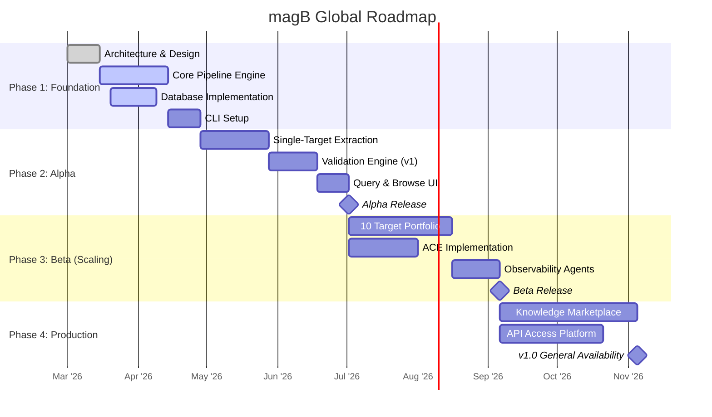
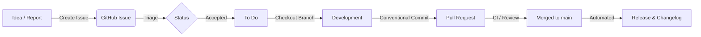

# 🗺️ magB Development Roadmap

Welcome to the **magB Project Roadmap**. This document explicitly defines our development phases, major milestones, and project management strategy. It serves as our north star for where we are going and how we measure progress.

---

## 📅 High-Level Timeline

We organize our work into sequential phases. While the foundation is linear, subsequent feature development happens in parallel.

---

## 📍 Detailed Phases & Milestones

### Phase 1: Engine Foundation (We are here)
Building the robust machinery that extracts and organizes knowledge.

- **Milestone 1.1: Project Setup (Completed)**
  - Open source repository architecture.
  - Project management tooling (Husky, Commitlint, Automated PRs).
  - Core marketing and contributing documentation.
- **Milestone 1.2: The Pipeline Engine**
  - Implement the 12-stage extraction state machine.
  - Multi-LLM provider integration (OpenAI, Anthropic).
  - Rate-limiting, cost-tracking, and robust retry logic.
- **Milestone 1.3: Knowledge Database**
  - Provision PostgreSQL + `pgvector`.
  - Prisma schema deployment with 12 core tables.
  - CRUD operations for Multi-Resolution Content and Delta Chains.

### Phase 2: Alpha Release
Proving the concept end-to-end on a single technology target (e.g., JSON).

- **Milestone 2.1: Single-Target Extraction (`JSON`)**
  - Complete extraction of Layer 1 (Capabilities).
  - Complete extraction of Layer 2 (Atoms & Algorithms).
  - Complete extraction of Layer 3 (Blueprints).
- **Milestone 2.2: The Validation Engine**
  - Cross-model verification.
  - Completeness anchor checking.
  - Code execution verification for `JSON` examples.
- **Milestone 2.3: Alpha User Experience**
  - `magb generate --target "JSON"` works locally.
  - `magb query` effectively traverses the semantic graph.

### Phase 3: Beta & Scaling
Expanding content horizontally and bringing in the community.

- **Milestone 3.1: The 'First 10' Targets**
  - Extract: Python, TypeScript, Rust, PPTX, PDF, PNG, SVG, CSV, YAML.
- **Milestone 3.2: AI Contribution Engine (ACE) v1**
  - Contributor credential vault.
  - Token budget manager.
  - Public impact dashboard.
- **Milestone 3.3: Observability v1**
  - Implementing the 5 Vital Signs tracking.
  - Automated "Immune System" regeneration triggers.

### Phase 4: Production & Ecosystem
Making the knowledge universally accessible and continually verified.

- **Milestone 4.1: Public Query API**
  - Hosted high-availability database.
  - API key provisioning.
- **Milestone 4.2: Ecosystem Integrations**
  - Native integration with major LLMs for Context-Injection.

---

## 🎯 Project Management Philosophy

To ensure magB stays organized as it scales, we strictly adhere to the following project management conventions:

### 1. Semantic Flow
Every change must be traceable from an Idea → Issue → PR → Release.

### 2. Issue Tracking & Board
- We use GitHub Projects (Kanban style).
- **Labels:** We use heavily standardized labels:
  - `type: bug`, `type: feature`, `type: docs`, `type: performance`
  - `status: needs-triage`, `status: accepted`, `status: in-progress`
  - `priority: critical`, `priority: high`, `priority: low`
  - `good first issue` for newcomers.

### 3. Conventional Commits (Strict)
We use `commitlint` and `husky` to enforce [Conventional Commits](https://www.conventionalcommits.org/). This allows us to fully automate our semantic versioning and changelog generation.

Format: `<type>(<scope>): <description>`  
Example: `feat(pipeline): add anthropic rate limiter tracking`

Valid Types: `feat`, `fix`, `docs`, `style`, `refactor`, `perf`, `test`, `build`, `ci`, `chore`, `revert`.

### 4. Branching Strategy
- `main`: The stable alpha/beta/release branch.
- feature branches: `feat/branch-name`, `fix/branch-name`, `docs/branch-name`.
- PRs must pass all CI checks before merging.
- Squash-and-merge is enforced to keep the mainline history clean.

---

## 📈 Tracking Progress

If you want to know what we are working on **right now**, check the following:
- [GitHub Project Board](../../projects) (Link placeholder - check repo for active board)
- Check the `#milestones` channel in discussions.
- Look for PRs targeting the current active milestone.
